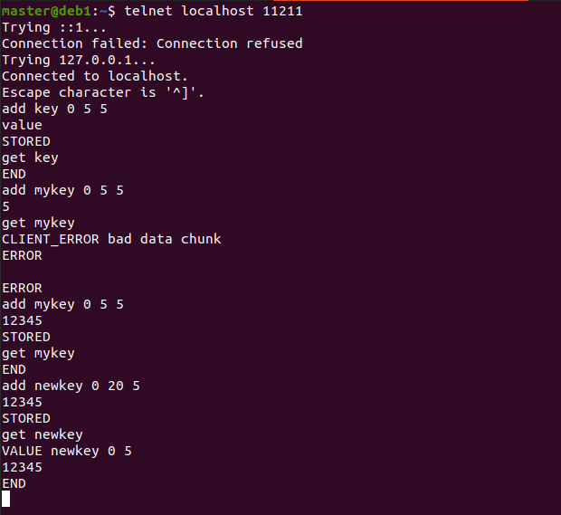
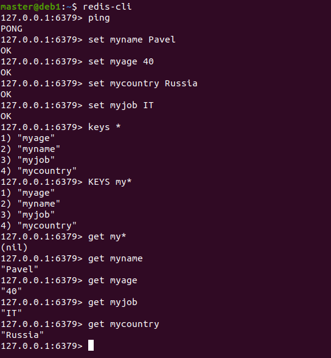

# Домашнее задание к занятию "`Кеширование Redis/memcached`" - `Аблогин Павел`

---

### Задание 1

`Примеры проблем, которые может решить кеширование:`

1. `Снижение производительности - устраняется с помощью размещения в кеше часто используемых данных.`

2. `Увеличение скорости ответа - данные в кеше, как правило размещаются в быстром хранилище, например, в ОЗУ. Благодаря этому скорость обращения к ним существенно выше , чем к основной БД. В связи с этим скорость ответа в целом существенно возрастает.`

3. `Нагрузка на основную БД - кеширование позволяет экономить ресурсы основной БД.`

4. `Скачки трафика - могут быть снижены благодаря использованию быстродействующего кеша.`

---

### Задание 2

`Установлен memcached и запущен в виде сервиса.`

`Скриншот выполнения задания 2`

---

### Задание 3

 `Записал в memcached несколько ключей, для которых выставлен TTL 5`

`Скриншоты выполнения задания 3`

---

### Задание 4

 `Установил Redis как сервис, записал несколько ключей, вывел значения ключей.`

`Скриншот выполнения задания 4`
`

---
## Дополнительные задания (со звездочкой*)

Эти задания дополнительные (не обязательные к выполнению) и никак не повлияют на получение вами зачета по этому домашнему заданию. Вы можете их выполнить, если хотите глубже и/или шире разобраться в материале.

### Задание 5

`Приведите ответ в свободной форме........`

1. `Заполните здесь этапы выполнения, если требуется ....`
2. `Заполните здесь этапы выполнения, если требуется ....`
3. `Заполните здесь этапы выполнения, если требуется ....`
4. `Заполните здесь этапы выполнения, если требуется ....`
5. `Заполните здесь этапы выполнения, если требуется ....`
6. 

`При необходимости прикрепитe сюда скриншоты
`
